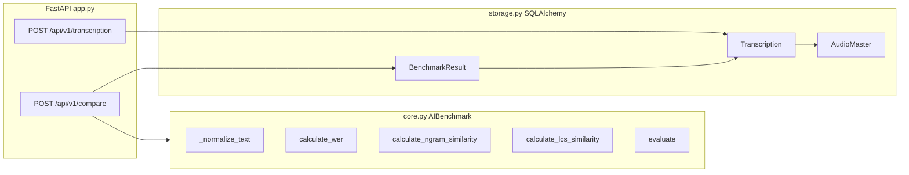
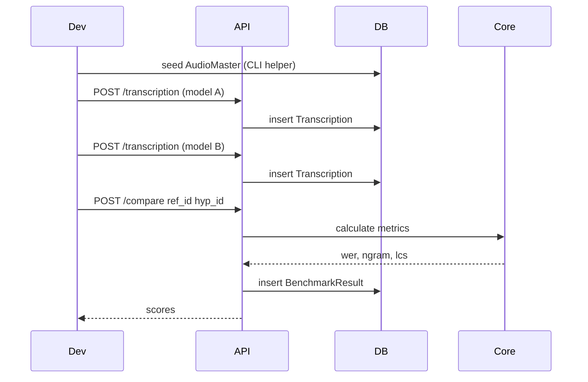

# طرح پیاده‌سازی ماژول `ai_benchmarker`

## محل و ساختار پوشه

پوشه اصلی در ریشه ریپو: [`ai_benchmarker/`](ai_benchmarker/)

```
ai_benchmarker/
├── pyproject.toml              # نصب‌پذیری pip install -e .
├── requirements.txt
├── .env.example
├── README.md
├── ai_benchmarker/
│   ├── __init__.py             # export AIBenchmark, create_app
│   ├── core.py                 # هسته بنچ‌مارک (طبق درخواست)
│   ├── storage.py              # مدل‌های SQLAlchemy (طبق درخواست)
│   ├── app.py                  # FastAPI (طبق درخواست)
│   ├── config.py               # DATABASE_URL و APP_PORT
│   ├── schemas.py              # Pydantic request/response
│   └── database.py             # engine, SessionLocal, init_db
└── tests/
    ├── test_core.py
    └── test_api.py
```

**چرا این ساختار؟** ریپو یک monorepo از پروژه‌های مستقل است (مثل [`export-sql-chromadb/`](export-sql-chromadb/))؛ هر پروژه `requirements.txt` خودش را دارد. نام `ai_benchmarker` با snake_case و ماژول‌های `core`/`storage`/`app` با درخواست شما هم‌خوان است. برای «قابل نصب بودن»، پکیج تو در تو + `pyproject.toml` اضافه می‌شود.



---

## 1. هسته محاسباتی — [`ai_benchmarker/core.py`](ai_benchmarker/ai_benchmarker/core.py)

کلاس `AIBenchmark` با متدهای استاتیک/نمونه‌ای تمیز و بدون وابستگی سنگین:

### `_normalize_text(text: str) -> str`
- تبدیل به lowercase
- حذف علائم نگارشی با `str.translate` + `string.punctuation` (و نگه‌داشتن حروف فارسی/عربی)
- نرمال‌سازی فاصله‌ها: `re.sub(r"\s+", " ", text).strip()`
- خروجی برای تمام متریک‌ها مشترک است

### `calculate_wer(reference: str, hypothesis: str) -> float`
- توکن‌سازی بر اساس فاصله (word-level)
- الگوریتم Levenshtein روی لیست کلمات با DP
- فرمول: `(substitutions + deletions + insertions) / len(reference_words)`
- اگر reference خالی باشد: `1.0` اگر hypothesis هم خالی نباشد، وگرنه `0.0`

### `calculate_ngram_similarity(reference, hypothesis, n=2) -> float`
- ساخت n-gram از **کلمات** (نه کاراکتر) برای هم‌خوانی با WER
- شباهت Jaccard: `|A ∩ B| / |A ∪ B|`
- متد یک `n` می‌گیرد؛ در `evaluate` دو بار با `n=2` و `n=3` صدا زده می‌شود

### `calculate_lcs_similarity(reference, hypothesis) -> float`
- LCS روی توالی کلمات با DP
- نسبت نرمال‌شده: `2 * lcs_len / (len(ref) + len(hyp))` (محدود به `[0, 1]`)

### `evaluate(ref_path: Path | str, hyp_path: Path | str) -> dict`
- خواندن دو فایل UTF-8
- نرمال‌سازی هر دو
- برگرداندن:

```python
{
    "wer": float,
    "ngram_bigram": float,
    "ngram_trigram": float,
    "lcs_score": float,
    "reference_normalized": str,
    "hypothesis_normalized": str,
}
```

---

## 2. لایه دیتابیس — [`ai_benchmarker/storage.py`](ai_benchmarker/ai_benchmarker/storage.py)

با SQLAlchemy 2.x declarative style (اولین استفاده از SQLAlchemy در ریپو — طبق الزام شما):

| مدل | فیلدها | روابط |
|-----|--------|-------|
| `AudioMaster` | `audio_guid` (PK, String/UUID), `file_name`, `approved_text` | `transcriptions`, `benchmark_results` |
| `Transcription` | `id` (PK), `audio_guid` (FK), `model_name`, `raw_text`, `normalized_text` | `audio`, `benchmarks_as_ref`, `benchmarks_as_hyp` |
| `BenchmarkResult` | `id` (PK), `audio_guid` (FK), `ref_id` (FK→Transcription), `hyp_id` (FK→Transcription), `wer`, `ngram_bigram`, `ngram_trigram`, `lcs_score` | `audio`, `reference`, `hypothesis` |

**نکته مهم:** Endpoint `/transcription` به `audio_guid` موجود در `AudioMaster` نیاز دارد. چون فقط دو Endpoint درخواست شده، یک helper در `database.py` اضافه می‌شود:

```python
def seed_audio_master(session, audio_guid, file_name, approved_text) -> AudioMaster
```

و در README مثال seed از CLI/Python مستند می‌شود. (در صورت نیاز بعدی می‌توان Endpoint سوم اضافه کرد.)

`normalized_text` هنگام ثبت Transcription با `AIBenchmark._normalize_text(raw_text)` پر می‌شود.

---

## 3. پیکربندی و Session — [`config.py`](ai_benchmarker/ai_benchmarker/config.py) + [`database.py`](ai_benchmarker/ai_benchmarker/database.py)

الگو از [`export-sql-chromadb/web_service/config.py`](export-sql-chromadb/web_service/config.py):

- `DATABASE_URL` پیش‌فرض: `sqlite:///./ai_benchmarker.db`
- `APP_HOST` / `APP_PORT` پیش‌فرض: `0.0.0.0` / `8090` (پورت 8080 در [`docs/infra-stack-compatibility.md`](docs/infra-stack-compatibility.md) اشغال است)
- `create_engine` با `connect_args={"check_same_thread": False}` برای SQLite
- `get_db()` dependency برای FastAPI
- `init_db()` در lifespan startup جداول را می‌سازد

---

## 4. وب‌سرویس — [`ai_benchmarker/app.py`](ai_benchmarker/ai_benchmarker/app.py)

FastAPI با lifespan (مشابه الگوی موجود در ریپو):

### `POST /api/v1/transcription`
Request ([`schemas.py`](ai_benchmarker/ai_benchmarker/schemas.py)):

```python
class TranscriptionCreate(BaseModel):
    audio_guid: str
    model_name: str
    raw_text: str
```

- بررسی وجود `AudioMaster` با `audio_guid` → در غیر این صورت `404`
- ذخیره `Transcription` با `normalized_text`
- Response: `id`, `audio_guid`, `model_name`, `normalized_text`

### `POST /api/v1/compare`
Request:

```python
class CompareRequest(BaseModel):
    ref_id: int      # Transcription مرجع (مثلاً متن تأییدشده ذخیره‌شده)
    hyp_id: int      # Transcription مدل
```

- بارگذاری هر دو رکورد؛ خطای `404` اگر نباشند
- اجرای متریک‌ها روی `normalized_text` هر دو
- ذخیره `BenchmarkResult` (با `audio_guid` مشترک از ref)
- Response: تمام فیلدهای `BenchmarkResult` + متریک‌ها

### Endpoint اضافی مینیمال
- `GET /health` — برای Docker/مانیتورینگ (الگوی رایج در ریپو)

---

## 5. وابستگی‌ها

[`requirements.txt`](ai_benchmarker/requirements.txt):

```
fastapi>=0.115.0
uvicorn[standard]>=0.32.0
sqlalchemy>=2.0.0
pydantic>=2.9.0
pydantic-settings>=2.6.0
python-dotenv>=1.0.1
```

[`pyproject.toml`](ai_benchmarker/pyproject.toml) با `setuptools` برای `pip install -e .`

**تست (dev):** `pytest>=8.0`, `httpx>=0.27` — فقط در بخش optional/dev

---

## 6. تست‌ها

| فایل | پوشش |
|------|------|
| `test_core.py` | WER شناخته‌شده (مثلاً ref=`hello world`, hyp=`hello word` → WER=0.5)، n-gram/LCS مرزبندی، `evaluate` با فایل موقت |
| `test_api.py` | seed AudioMaster → transcription → compare → بررسی BenchmarkResult در DB (SQLite in-memory با `DATABASE_URL=sqlite://`) |

---

## 7. مستندات و اجرا

[`README.md`](ai_benchmarker/README.md) شامل:
- `python -m venv .venv && pip install -e .`
- متغیرهای `.env` (از [`.env.example`](ai_benchmarker/.env.example))
- اجرا: `uvicorn ai_benchmarker.app:app --reload`
- مثال curl برای هر Endpoint + seed اولیه AudioMaster

---

## جریان کاری پیشنهادی



---

## فایل‌های کلیدی موجود برای الگوبرداری

- FastAPI + config: [`export-sql-chromadb/web_service/app.py`](export-sql-chromadb/web_service/app.py), [`config.py`](export-sql-chromadb/web_service/config.py)
- Pydantic schemas: [`export-sql-chromadb/web_service/schemas.py`](export-sql-chromadb/web_service/schemas.py)
- پورت‌ها: [`docs/infra-stack-compatibility.md`](docs/infra-stack-compatibility.md)

## خارج از محدوده این فاز

- Docker / docker-compose (در صورت نیاز بعدی)
- Endpoint جدا برای AudioMaster
- یکپارچه‌سازی مستقیم با whisper-task-runner یا pipeline موجود
