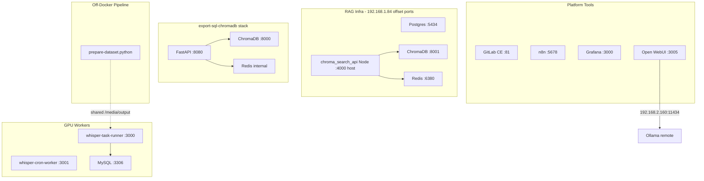

# Multi-Container Infrastructure Health Check & Audit Plan

## Current State Summary

The repo hosts **9 compose files** managing **~20+ containers** across 6 logical layers. There is **no shared Docker network** between stacks — all cross-service coupling happens via **host-published ports** (`192.168.1.84`) or self-contained sidecars. The most critical risks are **port conflicts**, **duplicate Chroma/Redis instances**, and **env file path mismatches** in `export-sql-chromadb`.



---

## Task 1: Cross-Service Dependency Mapping & Configuration Audit

### Compose Inventory

| # | File | Services | Custom Build | Key Host Ports |
|---|------|----------|--------------|----------------|
| 1 | [tools/gitlab/docker-compose.yml](tools/gitlab/docker-compose.yml) | postgres, redis, gitlab | — | 5433, 6379, 81, 444, 2222 |
| 2 | [apps/chroma_search_api/docker-compose.yml](apps/chroma_search_api/docker-compose.yml) | postgres, chromadb, redis | — | **5434, 8001, 6380** |
| 3 | [apps/chroma_search_api/docker-compose.redis.yml](apps/chroma_search_api/docker-compose.redis.yml) | postgres, chromadb, redis, typesense | — | **5433, 8000, 6379, 8108** |
| 4 | [export-sql-chromadb/docker-compose.yml](export-sql-chromadb/docker-compose.yml) | chroma-search-api, redis, chromadb | **FastAPI** | **8080, 8000** |
| 5 | [whisper-task-runner/docker-compose.yml](whisper-task-runner/docker-compose.yml) | app, mysql, adminer | **Node+Whisper** | **3000, 3306, 8080** |
| 6 | [whisper-cron-worker/docker-compose.yml](whisper-cron-worker/docker-compose.yml) | app | **Node+Whisper** | 3001 |
| 7 | [tools/grafana/docker-compose.yml](tools/grafana/docker-compose.yml) | prometheus, node-exporter, grafana | — | **3000**, 9090, 9100 |
| 8 | [tools/n8n/docker-compose.yml](tools/n8n/docker-compose.yml) | n8n, postgres | — | 5678 (internal PG) |
| 9 | [tools/open-web-ui/docker-compose.yml](tools/open-web-ui/docker-compose.yml) | open-webui | — | 3005 |

### Network Topology

- Each compose project creates an **isolated bridge network** (`rag_network`, `whisper_network`, or implicit default).
- **No `external: true` networks** — stacks cannot reach each other by Docker DNS.
- Cross-stack access requires **host IP + mapped port** (e.g. [apps/chroma_search_api/.env](apps/chroma_search_api/.env) uses `192.168.1.84:6380` and `:8001`).

### Volume Persistence

| Stack | Named Volumes | Bind Mounts |
|-------|---------------|-------------|
| chroma_search_api | `postgres_data`, `chroma_data`, `redis_data` | — |
| export-sql-chromadb | `redis-data`, `chroma-data` | — |
| whisper-task-runner | `mysql_data`, `whisper_model_cache` | `./media/input`, `./media/output`, `init.sql` |
| whisper-cron-worker | `whisper_model_cache`, `cron_config` | `./media/input`, `./media/output` |
| GitLab | `postgres_data`, `redis_data`, `gitlab_*` | — |
| n8n | `n8n_storage`, `postgres_data` | `./shared` |
| Grafana | `grafana-storage` | `./prometheus/prometheus.yml` |
| Open WebUI | — | `./open-webui` |

**Chroma data path divergence** (data silos):
- RAG stacks: `/chroma/chroma` (v2 heartbeat)
- export-sql-chromadb: `/chroma/app/data` (v1 heartbeat, token auth, allow-reset)

### Environment Variable Audit

#### Endpoint Matrix (Critical)

| Consumer | MySQL | Redis | Chroma | Postgres |
|----------|-------|-------|--------|----------|
| [whisper-task-runner/.env](whisper-task-runner/.env) | `mysql:3306` (in-stack) | — | — | — |
| [whisper-cron-worker/.env](whisper-cron-worker/.env) | — | — | — | — |
| [apps/chroma_search_api/.env](apps/chroma_search_api/.env) | — | `192.168.1.84:6380` | `192.168.1.84:8001` | — |
| [export-sql-chromadb/web_service/.env](export-sql-chromadb/web_service/.env) | — | unset → `localhost:6379` | `192.168.1.68:8000` | — |
| [export-sql-chromadb/.env.dev](export-sql-chromadb/.env.dev) | — | — | `192.168.1.68:8000` | — |
| [tools/n8n/.env](tools/n8n/.env) | — | — | — | `postgres:5432` |

#### Detected Misconfigurations (Dead Links)

1. **Missing root `.env` for export-sql-chromadb** — [web_service/config.py](export-sql-chromadb/web_service/config.py) loads `export-sql-chromadb/.env`, but only `web_service/.env` exists. Compose references `env_file: .env` which is also missing. **Runtime config is silently wrong unless vars are exported manually.**

2. **Two Chroma hosts** — Node app targets `.84:8001`; FastAPI targets `.68:8000`. Same collection name `book_pages_mini` may point at **different physical databases**.

3. **chroma_search_api variant mismatch** — [.env](apps/chroma_search_api/.env) aligns with [docker-compose.yml](apps/chroma_search_api/docker-compose.yml) (offset ports 8001/6380). Running [docker-compose.redis.yml](apps/chroma_search_api/docker-compose.redis.yml) instead breaks the Node app (expects 8000/6379).

4. **Duplicate `EMBEDDING_PROVIDER`** in `web_service/.env` — last value `gemini` wins, but `GEMINI_API_KEY` is a placeholder → embedding calls fail.

5. **Collection name drift** — `book_pages_mini` (app + web_service) vs `book_pages_full_embedding_provider_none` (.env.dev) vs `book_pages` (.env.example).

6. **whisper-task-runner MySQL is self-contained** — no mismatch with external DBs, but weak creds (`whisper123`/`root123`) are committed in `.env`, `.env.example`, and compose.

7. **Schema gap in prepare-dataset pipeline** — `split_audio_by_srt.py` writes `metadata.json`; `prepare_for_training.py` expects `segments_info.json` with transcript file paths. Pipeline stages are not wired end-to-end.

### Port Conflict Matrix (Cannot All Run on Same Host)

| Port | Conflicting Stacks |
|------|-------------------|
| **5433** | GitLab Postgres ↔ chroma_search_api `redis.yml` Postgres |
| **6379** | GitLab Redis ↔ chroma_search_api `redis.yml` Redis |
| **8000** | export-sql-chromadb Chroma ↔ chroma_search_api `redis.yml` Chroma |
| **3000** | Grafana ↔ whisper-task-runner API |
| **8080** | export-sql-chromadb API ↔ whisper-task-runner Adminer |

**Safe co-existence set on `192.168.1.84`:**
- GitLab + chroma_search_api **main** compose (offset ports) + export-sql-chromadb (only if Chroma on 8000 doesn't clash — it does with GitLab's redis.yml variant)
- Recommended: use **main** chroma_search_api compose (5434/8001/6380) + GitLab (5433/6379/81) + export-sql-chromadb on different Chroma port or remote host

---

## Task 2: Runtime Health Verification Script

After plan approval, create `scripts/infra-health-check.sh` at repo root with the following capabilities. The script is designed to run **read-only** on the live host.

### Script Features

```bash
#!/usr/bin/env bash
# scripts/infra-health-check.sh
# Usage: ./scripts/infra-health-check.sh [--since 2h] [--cpu-warn 80] [--mem-warn 85]
```

**Section 1 — Prerequisites & Container Discovery**
- Verify `docker`, `curl`, `nc`/`timeout` availability; optional `nvidia-smi`
- Map known containers by name pattern: `docusaurus_rag_*`, `whisper-*`, `gitlab*`, `n8n`, `postgres`, `export-sql-chromadb-*`, `grafana`, `prometheus`, `open-webui`

**Section 2 — Container Status & Resource Utilization**
- `docker ps -a --format` for state, health, uptime
- `docker stats --no-stream` with CPU/MEM thresholds (default warn: CPU 80%, MEM 85%)
- GPU: `nvidia-smi` on host + `docker exec` into `whisper-task-runner-app` / `whisper-cron-worker-app`
- Flag containers in `unhealthy`, `restarting`, or `exited` state

**Section 3 — Port & Connectivity Matrix**
- Host-level TCP probes to expected endpoints from [.env](apps/chroma_search_api/.env) and compose files:
  - Redis `192.168.1.84:6380` → `PING`
  - Chroma `192.168.1.84:8001` → `/api/v2/heartbeat`
  - Chroma `192.168.1.68:8000` → `/api/v1/heartbeat`
  - FastAPI `localhost:8080` → `/health`
  - Node search `localhost:4000` → health/root
  - MySQL `localhost:3306`, Grafana `:3000`, GitLab `:81`, n8n `:5678`, Ollama `192.168.2.160:11434`
- In-container probes via `docker exec`:
  - `whisper-task-runner-app` → `mysqladmin ping -h mysql`
  - `export-sql-chromadb` API → `redis-cli -h redis ping` + Chroma heartbeat
  - `n8n` → `pg_isready -h postgres`

**Section 4 — Log Aggregation & Error Pattern Detection**
- Parse last `--since` (default 2h) logs from 3 custom images:
  - `whisper-task-runner-app`
  - `whisper-cron-worker-app`
  - `export-sql-chromadb` chroma-search-api container
- Grep patterns:
  - `ECONNREFUSED|ETIMEDOUT|connection.*timeout|connect EHOSTUNREACH` (connectivity)
  - `EBUSY|ERESTART|database is locked|Lock wait timeout` (DB/lock issues)
  - `Error processing with Whisper|whisper.*error|CUDA|out of memory|No such file.*whisper` (CLI/GPU failures)
  - `level=error|ERROR|FATAL` (generic)
- Report count per pattern + last 3 matching lines

**Section 5 — Lock File Stale Check (whisper-task-runner)**
- Scan `whisper-task-runner/media/input/**/*.lock` for files older than `TASK_TIMEOUT_MINUTES` (default 120)

**Section 6 — Summary Report**
- Color-coded PASS/WARN/FAIL per section
- Exit code: 0 = all pass, 1 = warnings, 2 = critical failures

### Key Script Constants (from repo config)

```bash
HOST_IP="192.168.1.84"
CHROMA_RAG_PORT=8001
REDIS_RAG_PORT=6380
CHROMA_EXPORT_HOST="192.168.1.68"
CHROMA_EXPORT_PORT=8000
FASTAPI_PORT=8080
NODE_SEARCH_PORT=4000
WHISPER_API_PORT=3000
WHISPER_CRON_PORT=3001
MYSQL_PORT=3306
OLLAMA_HOST="192.168.2.160:11434"
```

---

## Task 3: Optimization & Security Review

### Dockerfile Analysis

#### [whisper-task-runner/Dockerfile](whisper-task-runner/Dockerfile) & [whisper-cron-worker/Dockerfile](whisper-cron-worker/Dockerfile) (95% identical)

| Check | Status | Recommendation |
|-------|--------|----------------|
| Multi-stage build | No | Extract shared base image; separate Python dep layer |
| Layer caching | Partial | `npm ci` cached; `pip install torch+whisper` rebuilds on any apt change — pin in `requirements.txt` |
| devDependencies stripped | Yes (`npm ci --only=production`) | Good |
| Base image size | Heavy (`nvidia/cuda:12.1.0-runtime`) | Use `node:20-slim` + NVIDIA Container Toolkit runtime |
| Non-root user | No (runs as root) | Add `USER node`, relocate whisper cache |
| `.dockerignore` | Missing | Exclude `.env`, `media/`, `node_modules/` |
| Shared image | Duplicated | Single `whisper-base` image for both services |

#### [export-sql-chromadb/Dockerfile](export-sql-chromadb/Dockerfile)

| Check | Status | Recommendation |
|-------|--------|----------------|
| Multi-stage | Named `base` but single stage | Builder stage for wheels; runtime drops `build-essential` |
| FastAPI production | Single uvicorn worker | Add `--workers 2` or gunicorn |
| ML deps always installed | `torch`, `transformers` in requirements | Split optional ML requirements |
| `.env` baked into image | `COPY web_service` may include `.env` | Add `.dockerignore` |
| Non-root user | No | Add dedicated UID |
| pip cache | `PIP_NO_CACHE_DIR=off` | Set to `1` for smaller image |

#### [apps/chroma_search_api](apps/chroma_search_api) (Node, no Dockerfile)

- Runs on host via `npm start` on port 4000
- Not containerized — consider adding a slim `node:20-alpine` Dockerfile for consistency

### Security Findings

| Severity | Issue | Location |
|----------|-------|----------|
| **High** | Hardcoded GitLab root password in compose | [tools/gitlab/docker-compose.yml](tools/gitlab/docker-compose.yml) |
| **High** | n8n basic auth disabled | [tools/n8n/.env](tools/n8n/.env) |
| **Medium** | MySQL/Adminer exposed on host (3306, 8080) | whisper-task-runner compose |
| **Medium** | GitLab Postgres/Redis exposed (5433, 6379) | GitLab compose |
| **Medium** | All custom containers run as root | 3 Dockerfiles |
| **Medium** | Typesense API key hardcoded `xyz` | docker-compose.redis.yml |
| **Low** | Weak default passwords committed | whisper, n8n, grafana |

### Observability Gap

- [tools/grafana/docker-compose.yml](tools/grafana/docker-compose.yml) only scrapes itself and node-exporter
- No metrics from Whisper GPU workers, ChromaDB, Redis, MySQL, or n8n
- Recommend adding cAdvisor + custom Prometheus targets for each stack

### Off-Docker Pipeline Containerization Strategy

**Recommended: CPU-only sidecar** (not GPU) triggered post-transcription:

```yaml
# prepare-dataset.python/docker-compose.yml (proposed)
services:
  prepare-dataset:
    build: .
    profiles: ["dataset-prep"]
    volumes:
      - ../whisper-task-runner/media/output:/data/input:ro
      - ./datasets:/data/output:rw
    environment:
      - THRESHOLD=70
      - REFERENCE_DIR=/data/references
    # no GPU reservation
```

**Prerequisites before containerizing:**
1. Unify `metadata.json` / `segments_info.json` schema
2. Add `requirements.txt` with pinned versions
3. Create `run_pipeline.py` entrypoint chaining align → split → HF export
4. Trigger via MySQL task status poll or webhook from whisper-task-runner on job completion

---

## Remediation Priority (Recommended Order)

1. **Create `export-sql-chromadb/.env`** — symlink or copy from canonical `web_service/.env`; fix duplicate `EMBEDDING_PROVIDER`
2. **Document which compose variants run on `.84`** — enforce main chroma_search_api compose (not redis.yml) alongside GitLab
3. **Resolve port 3000/8080 conflicts** — change Grafana or whisper Adminer/API ports via `.env`
4. **Unify Chroma topology** — decide `.84` vs `.68` or document intentional split
5. **Deploy health check script** and schedule via cron
6. **Dockerfile hardening** — `.dockerignore`, non-root, shared whisper base image
7. **Fix prepare-dataset schema gap** before sidecar containerization
8. **Rotate credentials** and enable n8n basic auth
