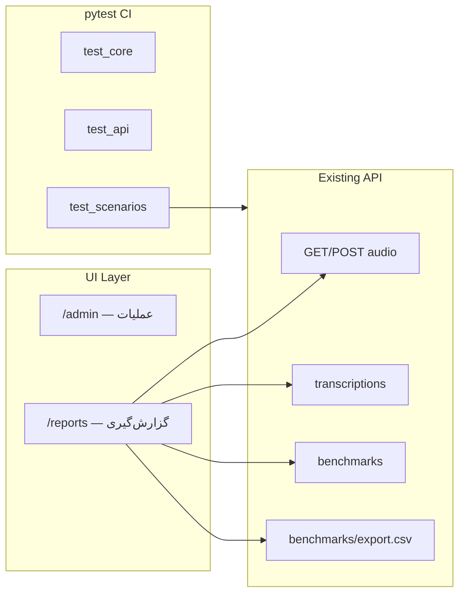

# طرح تثبیت: گزارش‌گیری، تست‌ها و CI/CD

## وضعیت فعلی

| بخش | وضعیت |
|-----|--------|
| API JSON (`/api/v1/audio/json`, transcription, compare) | آماده در [`ai_benchmarker/app.py`](ai_benchmarker/ai_benchmarker/app.py) |
| پنل عملیاتی `/admin` | آماده در [`ai_benchmarker/static/admin.html`](ai_benchmarker/ai_benchmarker/static/admin.html) |
| تست‌های پایه | [`tests/test_core.py`](ai_benchmarker/tests/test_core.py), [`tests/test_api.py`](ai_benchmarker/tests/test_api.py) |
| E2E شل | [`scripts/sample-e2e-test.sh`](ai_benchmarker/scripts/sample-e2e-test.sh) |
| CI تست | **وجود ندارد** — فقط workflow داکر در [`.github/workflows/ai-benchmarker-docker.yml`](.github/workflows/ai-benchmarker-docker.yml) |

**اصل طراحی:** هیچ پکیج جدیدی اضافه نمی‌شود. تست‌ها با `pytest` + `TestClient` (از `httpx` موجود) اجرا می‌شوند — نه `requests` به سرور زنده. این روش برای CI پایدارتر است (بدون نیاز به سرویس running).



---

## ۱. صفحه گزارش‌گیری — `/reports`

**فایل جدید:** [`ai_benchmarker/static/reports.html`](ai_benchmarker/ai_benchmarker/static/reports.html)

- Bootstrap 5 از CDN (`jsdelivr`) — بدون pip install
- RTL فارسی، read-only
- سه جدول با fetch از APIهای موجود:
  - **AudioMasters** ← `GET /api/v1/audio`
  - **Transcriptions** ← `GET /api/v1/transcriptions`
  - **BenchmarkResults** ← `GET /api/v1/benchmarks`
- Badge رنگی برای WER: سبز `<10%`، زرد `10-30%`، قرمز `>30%`
- دکمه «دانلود CSV» → `GET /api/v1/benchmarks/export.csv`
- لینک به `/admin` برای ثبت داده جدید

**تغییر در [`app.py`](ai_benchmarker/ai_benchmarker/app.py):**
```python
@application.get("/reports")
def reports_panel() -> FileResponse: ...
```

---

## ۲. Export CSV

**Endpoint جدید:** `GET /api/v1/benchmarks/export.csv`

- بدون وابستگی جدید — با `csv` استاندارد پایتون
- Query param اختیاری: `?audio_guid=...`
- ستون‌ها: `id, audio_guid, ref_model, hyp_model, wer, ngram_bigram, ngram_trigram, lcs_score`
- Header: `Content-Disposition: attachment; filename=benchmark_results.csv`
- Response: `StreamingResponse` یا `PlainTextResponse` با `media_type=text/csv`

**تست:** `test_export_csv_returns_valid_rows` در `tests/test_api.py`

---

## ۳. سناریوهای تست — `tests/test_scenarios.py`

فایل جدید با fixture مشترک از [`tests/test_api.py`](ai_benchmarker/tests/test_api.py) (استخراج به `tests/conftest.py`).

هر سناریو: ثبت مرجع → ثبت hyp → compare → assert در DB + API.

| سناریو | مدل | متن hyp | انتظار WER | انتظار LCS |
|--------|-----|---------|------------|------------|
| **ideal** | `model-ideal` | تطبیق کامل با مرجع | `0.0` | `1.0` |
| **medium** | `model-medium` | تغییر ۱-۲ کلمه (لحن) | `0.1` ± `0.05` | `> 0.8` |
| **weak** | `model-weak` | حذف بخش زیادی از متن | `> 0.4` | `< 0.7` |

متن مرجع ثابت (فارسی، قابل تکرار):
```
سلام دنیا این یک متن مرجع برای تست بنچمارک است
```

**Assert‌ها در هر سناریو:**
- `POST /api/v1/compare` → status 201
- `GET /api/v1/benchmarks` شامل رکورد جدید
- مقادیر `wer`, `ngram_bigram`, `lcs_score` در بازه مورد انتظار
- رکورد در جدول `BenchmarkResult` (query مستقیم DB)

**تست‌های تکمیلی در همان فایل:**
- `test_scenario_srt_reference_parsing` — مرجع از SRT، hyp از متن ساده
- `test_scenario_all_three_ranked_by_wer` — weak > medium > ideal

---

## ۴. گسترش تست‌های موجود

| فایل | اضافه می‌شود |
|------|-------------|
| [`tests/conftest.py`](ai_benchmarker/tests/conftest.py) | fixture `client` + helper `create_reference()` |
| [`tests/test_utils.py`](ai_benchmarker/tests/test_utils.py) | تست `parse_subtitle_text` برای `.srt` و `.txt` |
| [`tests/test_api.py`](ai_benchmarker/tests/test_api.py) | تست `/reports`، لیست endpoints، CSV export |
| [`tests/test_scenarios.py`](ai_benchmarker/tests/test_scenarios.py) | ۳ سناریو + ranking |

**اجرای محلی:**
```bash
cd ai_benchmarker
pytest -v --tb=short
```

**اسکریپت:** [`scripts/run-tests.sh`](ai_benchmarker/scripts/run-tests.sh) — wrapper برای سرور آفلاین

---

## ۵. CI/CD — GitHub Actions

**فایل جدید:** [`.github/workflows/ai-benchmarker-tests.yml`](.github/workflows/ai-benchmarker-tests.yml)

```yaml
on:
  push:
    paths: ["ai_benchmarker/**"]
  pull_request:
    paths: ["ai_benchmarker/**"]
jobs:
  test:
    runs-on: ubuntu-latest
    steps:
      - checkout
      - setup-python 3.12
      - pip install -e "ai_benchmarker[dev]"
      - pytest ai_benchmarker/tests -v --tb=short
```

- بدون شبکه بعد از نصب (pytest با SQLite in-memory)
- جدا از workflow داکر موجود
- badge در `DOCUMENTATION.md` قابل اضافه شدن

---

## ۶. مستندسازی — `DOCUMENTATION.md`

**فایل جدید:** [`ai_benchmarker/DOCUMENTATION.md`](ai_benchmarker/DOCUMENTATION.md)

بخش‌ها:
1. **معماری** — جداول DB، flow ثبت تا compare
2. **اجرای سرویس** — systemd، `run.sh`
3. **پنل‌ها** — `/admin` (عملیات) vs `/reports` (گزارش)
4. **API با curl** — نمونه‌های JSON برای هر endpoint
5. **اجرای تست‌ها** — `pytest`, `run-tests.sh`, CI
6. **Export CSV** — دستور curl و دکمه UI
7. **عیب‌یابی آفلاین** — wheels، بدون multipart

---

## ۷. فایل‌های تغییر یافته (خلاصه)

| فایل | عمل |
|------|-----|
| `ai_benchmarker/app.py` | route `/reports` + CSV export |
| `ai_benchmarker/static/reports.html` | صفحه گزارش Bootstrap |
| `tests/conftest.py` | fixture مشترک |
| `tests/test_scenarios.py` | ۳ سناریو بنچمارک |
| `tests/test_utils.py` | تست SRT parser |
| `tests/test_api.py` | reports + CSV |
| `scripts/run-tests.sh` | اجرای تست |
| `.github/workflows/ai-benchmarker-tests.yml` | CI |
| `DOCUMENTATION.md` | مستندات کامل |

**بدون تغییر:** `core.py`, `storage.py`, `requirements` (csv/stdlib کافی است)

---

## ترتیب پیاده‌سازی

1. `conftest.py` + `test_scenarios.py` (تست‌ها اول — TDD)
2. CSV endpoint + تست آن
3. `reports.html` + route
4. `test_utils.py` + گسترش `test_api.py`
5. `run-tests.sh` + CI workflow
6. `DOCUMENTATION.md`
7. اجرای `pytest` روی سرور و `systemctl restart ai-benchmarker`
