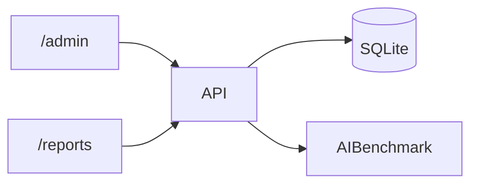

# AI Benchmarker — مستندات

## معماری



### جداول دیتابیس

| جدول | فیلدهای کلیدی |
|------|---------------|
| `audio_master` | `audio_guid` (PK), `file_name`, `approved_text` |
| `transcription` | `id`, `audio_guid`, `model_name`, `raw_text`, `normalized_text` |
| `benchmark_result` | `id`, `ref_id`, `hyp_id`, `wer`, `ngram_*`, `lcs_score` |

### جریان کار

1. ثبت فایل مرجع → دریافت `audio_guid` + `reference_transcription_id`
2. ثبت transcription مدل‌ها
3. مقایسه ref vs hyp → ذخیره در `benchmark_result`
4. مشاهده در `/reports` یا Export CSV

---

## اجرای سرویس

```bash
# نصب آفلاین
bash scripts/install-offline.sh
source .venv/bin/activate

# اجرای موقت
bash scripts/run.sh

# سرویس دائمی (systemd)
sudo cp scripts/ai-benchmarker.service /etc/systemd/system/
sudo systemctl enable --now ai-benchmarker
```

پورت پیش‌فرض: **8090**

---

## پنل‌ها

| آدرس | کاربرد |
|------|--------|
| `/admin` | ثبت مرجع، transcription، مقایسه |
| `/reports` | گزارش read-only با Bootstrap + فیلتر GUID |
| `/health` | Health check |

---

## API — نمونه curl

### ثبت فایل مرجع

```bash
curl -X POST http://localhost:8090/api/v1/audio/json \
  -H "Content-Type: application/json" \
  -d '{"file_name":"ref.txt","approved_text":"سلام دنیا"}'
```

### ثبت Transcription

```bash
curl -X POST http://localhost:8090/api/v1/transcription \
  -H "Content-Type: application/json" \
  -d '{"audio_guid":"GUID","model_name":"whisper","raw_text":"سلام دنیا!"}'
```

### مقایسه

```bash
curl -X POST http://localhost:8090/api/v1/compare \
  -H "Content-Type: application/json" \
  -d '{"ref_id":1,"hyp_id":2}'
```

### لیست‌ها

```bash
curl http://localhost:8090/api/v1/audio
curl "http://localhost:8090/api/v1/transcriptions?audio_guid=GUID"
curl "http://localhost:8090/api/v1/benchmarks?audio_guid=GUID"
```

### Export CSV

```bash
curl -O -J "http://localhost:8090/api/v1/benchmarks/export.csv"
curl -O -J "http://localhost:8090/api/v1/benchmarks/export.csv?audio_guid=GUID"
```

یا از دکمه «دانلود CSV» در `/reports`.

---

## تست‌ها

### اجرای محلی

```bash
cd ai_benchmarker
bash scripts/run-tests.sh
# یا:
pytest tests -v --tb=short
```

### سناریوهای تست (`tests/test_scenarios.py`)

| سناریو | توضیح | انتظار WER |
|--------|-------|------------|
| ideal | تطبیق کامل | 0% |
| medium | تغییر لحن (۱ کلمه) | ~10% |
| weak | حذف بخش زیاد متن | >40% |

### E2E دستی (سرور زنده)

```bash
bash scripts/sample-e2e-test.sh
```

### CI/CD

Workflow: `.github/workflows/ai-benchmarker-tests.yml`

روی هر push/PR در `ai_benchmarker/**` اجرا می‌شود:

```yaml
pip install -e "./ai_benchmarker[dev]"
pytest tests -v --tb=short
```

---

## عیب‌یابی آفلاین

- **pip نصب نمی‌شود:** wheels لینوکس از `download-wheels-linux.ps1` روی ویندوز
- **multipart لازم نیست:** همه endpointها JSON هستند (`/api/v1/audio/json`)
- **تست‌ها:** SQLite in-memory — نیازی به سرور running نیست

---

## Postman

1. `POST /api/v1/audio/json` — Body: raw JSON
2. `POST /api/v1/transcription` — Body: raw JSON
3. `POST /api/v1/compare` — Body: `{"ref_id":1,"hyp_id":2}`
4. `GET /api/v1/benchmarks/export.csv` — Save as file
